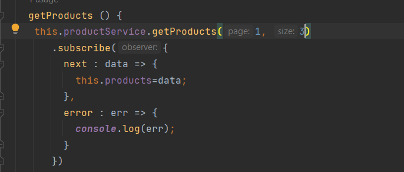

<h1 align="center">Angular-Demo-App</h1>

 
 
<h4>La liste des produits dans le composant "products" :</h4>

 
<h4>la liste des produits (Pagination) :</h4>

 
<h4>Faire une recherche on utilisant un "Keyword" :</h4>

 
<h4>Supprimer un produit :</h4>

 
<h4>Ajouter un produit dans le composant "new-product" :</h4>

 
<h4>Les services qu'on a :</h4>

 
<h4>les composants, le model, le service et Json-Server utilisés : </h4>

